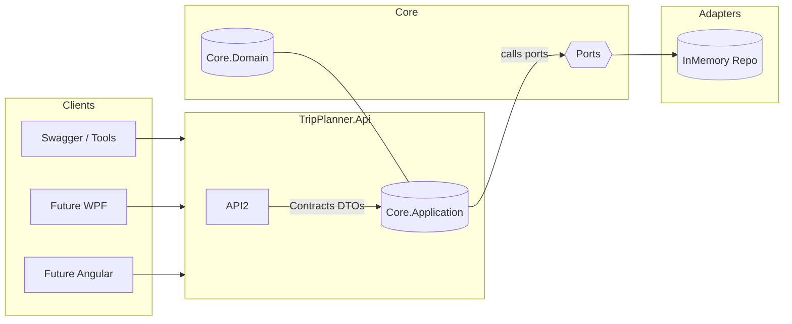
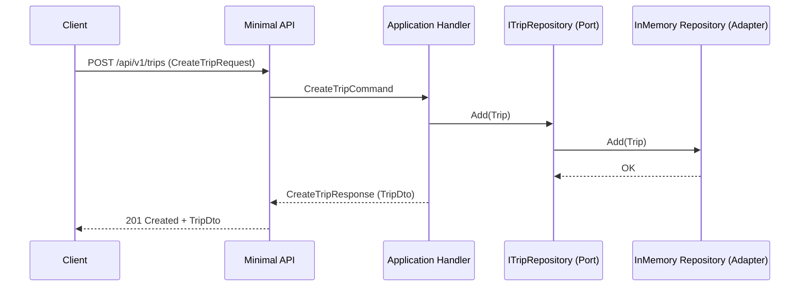
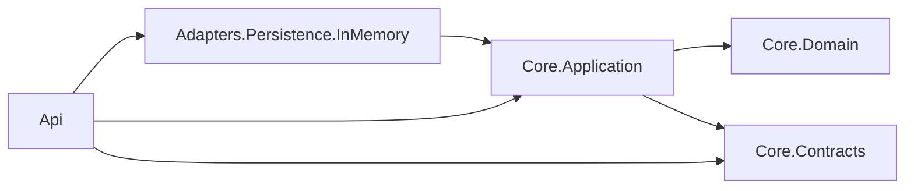

# TripperApp
Seminar Advanced C# Project with the aim of providing a handy tool for planning trips (TRIP PlanER)


```bash
# Run from repo root
$target = 90KB
$files = Get-ChildItem -Recurse -File -Include *.cs |
  Where-Object {
    $_.FullName -notmatch '\\(bin|obj|\.vs|\.idea)\\' -and
    $_.Name -notmatch '(\.g(\.i)?\.cs$|\.designer\.cs$|AssemblyInfo\.cs$|GlobalUsings\.g\.cs$)'
  }
$bytes = ($files | Measure-Object Length -Sum).Sum
$kb    = [math]::Round($bytes/1KB, 2)
if ($bytes -ge $target) {
  Write-Host "C# source total: $kb KB ($bytes bytes) — ✅ PASS (≥ 90 KB)"
} else {
  $short = [math]::Round(($target-$bytes)/1KB,2)
  Write-Host "C# source total: $kb KB ($bytes bytes) — ❌ Need $short KB more to reach 90 KB"
}

# Without tests
$target = 90KB
$files = Get-ChildItem -Recurse -File -Include *.cs -Path src |
  Where-Object {
    $_.FullName -notmatch '\\(bin|obj|\.vs|\.idea)\\' -and
    $_.Name -notmatch '(\.g(\.i)?\.cs$|\.designer\.cs$|AssemblyInfo\.cs$|GlobalUsings\.g\.cs$)'
  }
$bytes = ($files | Measure-Object Length -Sum).Sum
$kb    = [math]::Round($bytes/1KB, 2)
if ($bytes -ge $target) {
  Write-Host "C# source in src/: $kb KB ($bytes bytes) — ✅ PASS (≥ 90 KB)"
} else {
  $short = [math]::Round(($target-$bytes)/1KB,2)
  Write-Host "C# source in src/: $kb KB ($bytes bytes) — ❌ Need $short KB more"
}

# Per folder
$files | ForEach-Object {
  [pscustomobject]@{
    Project = (Resolve-Path -Relative $_.FullName) -replace '^\.\\','' -replace '\\[^\\]+$',''
    KB      = [math]::Round($_.Length/1KB,2)
  }
} | Group-Object Project | ForEach-Object {
  [pscustomobject]@{
    Project = $_.Name
    KB      = [math]::Round( ($_.Group | Measure-Object KB -Sum).Sum, 2)
  }
} | Sort-Object KB -Descending | Format-Table -Auto
```

```bash
# Random
dotnet tool install --global dotnet-ef

```

```bash
dotnet build
```

```bash
 dotnet run --project src/TripPlanner.Api
```

```bash
# POST
Invoke-RestMethod -Method Post -Uri http://localhost:5162/api/v1/trips `
  -ContentType application/json `
  -Body '{"name":"Snezka Hike","organizerId":"00000000-0000-0000-0000-000000000001"}'
```
```bash
# GET
Invoke-RestMethod http://localhost:5162/api/v1/trips
```

# TripPlanner — Base Architecture Overview

This repo is a **front‑end–agnostic base** for a trip planning platform, structured around **Hexagonal (Ports & Adapters)** with a light touch of **CQRS**. It runs today with an **ASP.NET Core Minimal API** and an **in‑memory persistence adapter** so you can develop quickly, then swap adapters (e.g., EF Core/SQLite) without touching core logic.

---

## What you have today (MVP)

* **.NET 9** solution with clean layering and DI ready.
* **Core.Domain**: pure domain model with a `Trip` aggregate and strong IDs (`TripId`, `UserId`).
* **Core.Contracts**: DTOs and a small error contract: `TripDto`, `CreateTripRequest/Response`, `ErrorCodes`, `ErrorResponse`.
* **Core.Application**: application ports (`ITripRepository`, `IUnitOfWork`) and two use cases:

    * `CreateTripHandler` (command)
    * `ListTripsHandler` (query)
* **Adapters.Persistence.InMemory**: `InMemoryTripRepository` + service registration extension.
* **Api**: Minimal API exposing **V1** endpoints:

    * `POST /api/v1/trips` — create a trip (validates GUID)
    * `GET  /api/v1/trips` — list trips
    * Swagger UI included.
* **Tests.Domain**: example xUnit tests for the domain (`TripTests`).
* **Directory.Build.props** pinned to `net9.0` with nullable + implicit usings.

> **Goal:** Keep the UI thin (WPF/Angular/etc. later). All business logic belongs in **Domain**/**Application**. Adapters are swappable.

---

## Project layout

```
TripPlanner.sln
Directory.Build.props
src/
  TripPlanner.Core.Domain/
  TripPlanner.Core.Contracts/
  TripPlanner.Core.Application/
  TripPlanner.Adapters.Persistence.InMemory/
  TripPlanner.Api/
tests/
  TripPlanner.Tests.Domain/
```

### Responsibilities per project

* **Core.Domain**: Entities, value objects, invariants. No external deps.
* **Core.Contracts**: DTOs, request/response shapes, error model. Shared across boundaries.
* **Core.Application**: Use cases (handlers), ports (interfaces). Depends only on Domain + Contracts.
* **Adapters.Persistence.InMemory**: Implements ports for quick dev.
* **Api**: HTTP delivery adapter. Maps HTTP ⇄ Contracts ⇄ Application handlers.
* **Tests.Domain**: Unit tests for domain behavior.

---

## Build & run

```bash
# From repo root
 dotnet build
 dotnet run --project src/TripPlanner.Api
# Then open the printed URL + /swagger (e.g., http://localhost:5162/swagger)
```

**PowerShell examples**

```powershell
# Create a trip (PowerShell-native)
Invoke-RestMethod -Method Post -Uri http://localhost:5162/api/v1/trips `
  -ContentType application/json `
  -Body '{"name":"Snezka Hike","organizerId":"00000000-0000-0000-0000-000000000001"}'

# List trips
Invoke-RestMethod http://localhost:5162/api/v1/trips
```

---

## Design principles

* **Hexagonal (Ports & Adapters)**: Core logic defines **ports**; adapters implement them.
* **CQRS-lite**: Separate commands/queries at the Application level for clarity.
* **Contracts-first**: UIs and integrations use stable DTOs.
* **Thin delivery**: API layer performs I/O, validation, and mapping—business rules live in the core.
* **Replaceable infrastructure**: Start in-memory; swap to EF/SQLite without rewriting use cases.

---

## Component diagram (mermaid)



---

## Request flow (mermaid sequence)



---

## Current API (V1)

### POST /api/v1/trips

**Body**

```json
{ "name": "Snezka Hike", "organizerId": "00000000-0000-0000-0000-000000000001" }
```

**Responses**

* 201 Created → `TripDto`
* 400 BadRequest → validation error (e.g., non-GUID organizerId)

### GET /api/v1/trips

**Query**

* `skip`, `take` (optional)

**Responses**

* 200 OK → `TripDto[]`

> Tip: Swagger at `/swagger` shows and executes both endpoints.

---

## Dependencies between projects (mermaid)



---

## Testing quickstart

```bash
# Domain tests
 dotnet test tests/TripPlanner.Tests.Domain
```

Add more tests per layer later (Application, Api, Persistence).

---

## Roadmap (suggested next steps)

1. **Persistence (EF Core + SQLite)**

    * Create `TripPlanner.Adapters.Persistence.Ef` with `AppDbContext`, `TripRecord`, `TripRepository`, `EfUnitOfWork`.
    * Swap registration in Api (`AddEfPersistence`).
2. **More use cases**

    * Add: `GetTripById`, `AddParticipant`, `ProposeDateOption`, `CastVote`.
3. **Contracts & Validation**

    * Fluent validation for request DTOs.
4. **Client SDK**

    * `TripPlanner.Client` (typed HttpClient) for .NET frontends.
5. **UI**

    * Thin WPF or Angular consuming the API.
6. **OpenAPI**

    * Add Swashbuckle annotations & examples; publish OpenAPI spec.
7. **CI**

    * GitHub Actions: build + test matrix.

---

## Dev tips

* **Rider run**: Create a ".NET Launch Settings Profile" config for `TripPlanner.Api` and press ▶. Open `/swagger`.
* **PowerShell vs curl**: Use `Invoke-RestMethod` in PowerShell, or call `curl.exe` explicitly.
* **.gitignore**: Keep `bin/`, `obj/`, `.vs/`, `.idea/` out of Git; don’t commit `*.csproj.user`.

---

Happy hacking! This base is intentionally small but structured, so adding features is straightforward without entangling UI and core logic.
