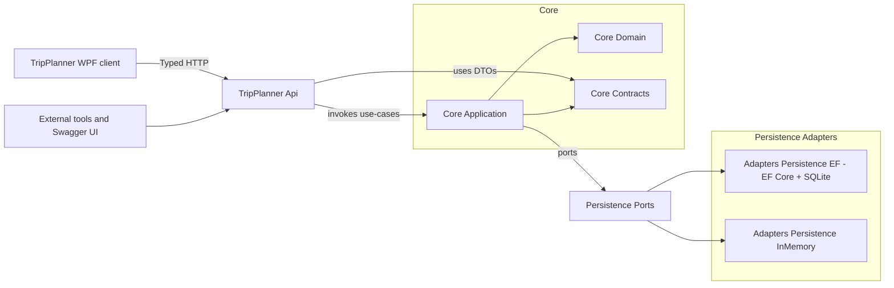
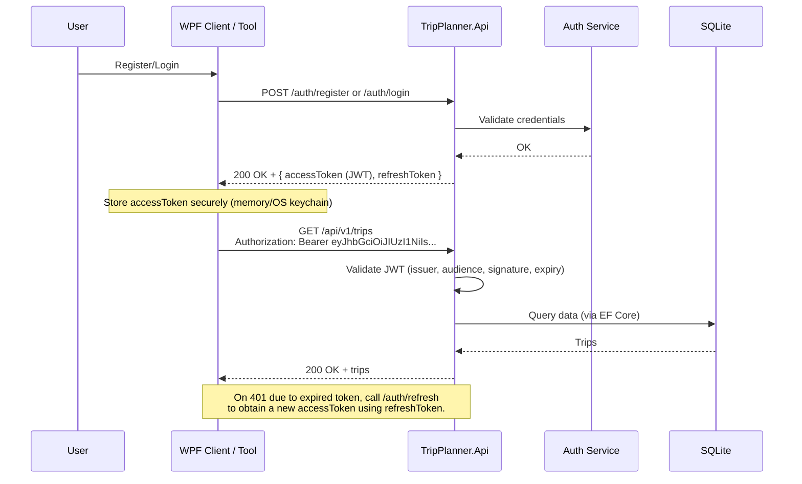

# TripPlanner
A .NET 9 trip planning application with a clean architecture, Minimal API backend, and a WPF desktop client. It helps small groups plan trips collaboratively: propose destinations and dates, vote, manage gear, invite participants, and build an itinerary. The core is organized with ports and adapters so infrastructure can be swapped without touching business logic.


## Key features
- Create and manage trips with statuses
- Invite participants (codes and links), join by invite
- Propose destinations with images; cast and revoke votes
- Propose date options; vote for preferred dates
- Manage participants, gear, transportation, and itinerary items
- Authentication with JWT (register, login, refresh, logout)
- WPF client for an opinionated desktop experience (MVVM)
- SQLite persistence by default (EF Core) with pluggable in-memory adapter for tests/dev
- OpenAPI/Swagger UI for fast API exploration


## Tech stack
- .NET 9, C# 13
- ASP.NET Core Minimal API
- WPF (net9.0-windows)
- EF Core (SQLite)
- xUnit tests (unit + integration)
- Docker (optional) for easy local runs


## Repository layout
```
TripPlanner.sln
Directory.Build.props
README.md
src/
  TripPlanner.Core.Domain/           # Domain entities and invariants (no external deps)
  TripPlanner.Core.Contracts/        # DTOs, request/response shapes, error model
  TripPlanner.Core.Application/      # Use cases + ports (interfaces)
  TripPlanner.Adapters.Persistence.InMemory/ # In-memory repo/IoC for quick dev/tests
  TripPlanner.Adapters.Persistence.Ef/       # EF Core + SQLite adapter
  TripPlanner.Api/                   # Minimal API + Swagger + Auth
  TripPlanner.Client/                # Typed HTTP client SDK for .NET frontends
  TripPlanner.Wpf/                   # WPF desktop client (MVVM)
tests/
  TripPlanner.Tests.Domain/          # Domain unit tests
  TripPlanner.Tests.Integration/     # API integration tests
tools/
  smoke-api.ps1                      # End-to-end API smoke script
```


## Prerequisites
- .NET SDK 9.0+
- PowerShell 7+ (pwsh) recommended for scripts on Windows
- Docker Desktop (optional, for containerized runs)


## Getting started (local)
1) Build the solution
- pwsh
  dotnet build

2) Run the API (Development)
- pwsh
  dotnet run --project src\TripPlanner.Api
- Browse Swagger UI at the printed URL, e.g. http://localhost:5162/swagger

3) Try a couple of endpoints (PowerShell)
- Create a trip
```powershell
Invoke-RestMethod -Method Post -Uri http://localhost:5162/api/v1/trips `
  -ContentType application/json `
  -Body '{"name":"Snezka Hike","organizerId":"00000000-0000-0000-0000-000000000001"}'
```
- List trips
```powershell
Invoke-RestMethod http://localhost:5162/api/v1/trips
```

4) Run the WPF client (optional)
- Ensure the API is running
- pwsh
  dotnet run --project src\TripPlanner.Wpf
- The WPF app defaults to the same localhost API. Some features (e.g., images) assume writeable storage by the API.


## Configuration
App settings are in src\TripPlanner.Api\appsettings.json and appsettings.Development.json.
- ConnectionStrings:Default — SQLite file path (default: Data Source=tripplanner.db)
- Jwt: Issuer, Audience, Key — dev-only defaults included; set strong secrets for real deployments
- Static uploads (destination images) are served from the API’s web root under /uploads

Override settings via environment variables (Docker-friendly):
- ConnectionStrings__Default=Data Source=/app/data/tripplanner.db
- ASPNETCORE_ENVIRONMENT=Development


## Docker quickstart
A simple compose file runs the API with a persisted SQLite database volume.
- pwsh
  docker compose up --build
- Open http://localhost:5162/swagger
- Stop and remove containers when done
- pwsh
  docker compose down


## EF Core (SQLite) notes
- The EF adapter project lives in src\TripPlanner.Adapters.Persistence.Ef
- Default SQLite connection string: Data Source=tripplanner.db
- Install global tools if needed
  dotnet tool install --global dotnet-ef
- Typical commands (run from repository root or EF project folder):
  dotnet ef migrations add Init -p src/TripPlanner.Adapters.Persistence.Ef -s src/TripPlanner.Api
  dotnet ef database update -p src/TripPlanner.Adapters.Persistence.Ef -s src/TripPlanner.Api

The API is already wired to use EF/SQLite by default in Development. The in-memory adapter is available for tests.


## API overview
- Swagger/OpenAPI available at /swagger
- Public endpoints (selection):
  - Auth: /auth/register, /auth/login, /auth/refresh, /auth/logout
  - Trips: POST /api/v1/trips, GET /api/v1/trips, PATCH /api/v1/trips/{id}/status
  - Participants: invites, join by code
  - Destinations: propose/list, votes (self and proxy placeholders)
  - Dates: propose/list, votes (self and proxy placeholders)
  - Gear, Transportation, Itinerary: CRUD-like endpoints

See the source files in src\TripPlanner.Api\Endpoints for the full map.

## Architecture diagrams

Project modules and adapters


JWT auth flow and protected API call



## Tests
- Run all tests
  dotnet test
- Run domain tests only
  dotnet test tests/TripPlanner.Tests.Domain
- Run integration tests
  dotnet test tests/TripPlanner.Tests.Integration


## API smoke test
A comprehensive PowerShell script exercises the API end-to-end.
- Prereqs: API running locally; PowerShell 7+
- Run from repo root
  pwsh tools/smoke-api.ps1
  pwsh -File .\tools\smoke-api.ps1
The script registers two users if missing, then walks through trips, invites, dates, destinations, placeholders, and gear workflows, failing fast on HTTP errors.


## Troubleshooting
- Port already in use: check launchSettings.json or change the exposed port in docker-compose.yml
- SQLite file locked on Windows: stop the API or Docker container before deleting tripplanner.db
- 401/403 from API: ensure you pass the Bearer token from /auth/login for protected endpoints
- Images not showing in WPF: verify API is running and static uploads directory exists


## Roadmap (high level)
- More validation and richer domain rules
- Offline sync for the WPF client
- Background jobs for reminders/notifications
- CI pipeline (build, test, smoke) and automatic OpenAPI publishing


## License
Educational project for an Advanced C# seminar. If you plan to reuse or publish, please add or adjust a license that fits your needs.

---

