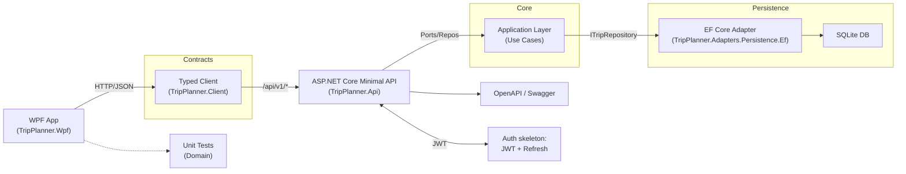

```mermaid
flowchart LR
    WPF["WPF App<br/>(TripPlanner.Wpf)"] -- "HTTP/JSON" --> CLIENT["Typed Client<br/>(TripPlanner.Client)"]
    CLIENT -- "/api/v1/*" --> API["ASP.NET Core Minimal API<br/>(TripPlanner.Api)"]
    API -- "Ports/Repos" --> APP["Application Layer<br/>(Use Cases)"]
    APP -- "ITripRepository" --> EF["EF Core Adapter<br/>(TripPlanner.Adapters.Persistence.Ef)"]
    EF --> DB["SQLite DB"]

    subgraph Core
        APP
    end

    subgraph Persistence
        EF
        DB
    end

    subgraph Contracts
        CLIENT
    end

    WPF -.-> Tests["Unit Tests<br/>(Domain)"]
    API --> Swagger["OpenAPI / Swagger"]
    API <-- "JWT" --> Auth["Auth skeleton:<br/>JWT + Refresh"]
```