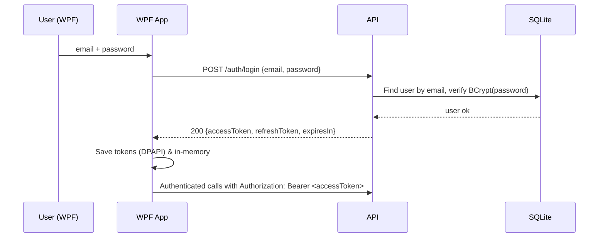
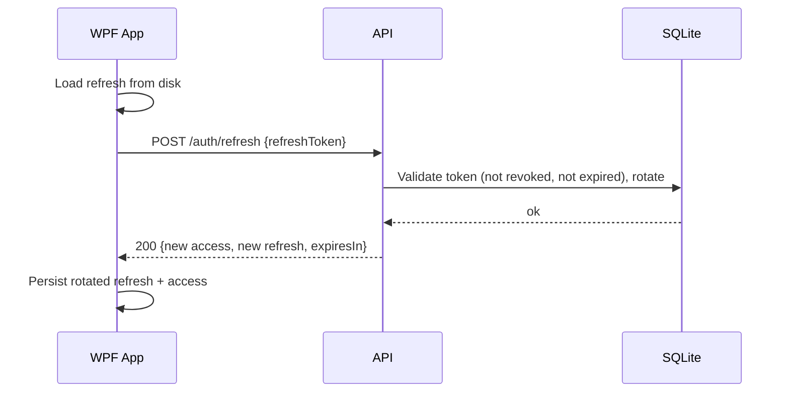
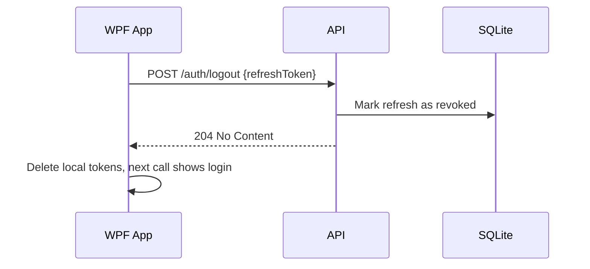
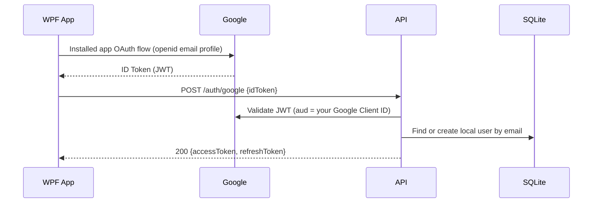

# TripperApp – Authentication & Authorization README

This document explains **how login/registration works**, where credentials/tokens are **stored**, **who issues tokens**, how they’re **used by the WPF client**, and what the current **security properties & gaps** are.

---

## High‑level picture

* **Identity store**: your API (TripPlanner.Api) keeps users in EF Core (SQLite).
* **Password hashing**: BCrypt (tunable work factor) – plaintext passwords are never stored.
* **Tokens**:

    * **Access token**: short‑lived **JWT** issued and signed by **your API** (HMAC SHA‑256) with `Issuer/Audience` from config.
    * **Refresh token**: random, opaque string stored **server‑side** (DB) with expiration & revocation.
* **Client (WPF)** stores tokens **locally per user** and automatically attaches/refreshes them for API calls.
* **Optional**: Google Sign‑In. WPF gets a Google **ID token** and sends it to `/auth/google`. The API verifies it with Google and **still issues your own JWT + refresh**.

---

## Endpoints (current)

```
POST /auth/register { email, password, displayName }  -> 201 Created (local user)
POST /auth/login    { email, password }               -> 200 { accessToken, refreshToken, expiresIn }
POST /auth/refresh  { refreshToken }                  -> 200 { accessToken, refreshToken, expiresIn }
POST /auth/logout   { refreshToken }                  -> 204 (refresh revoked)
GET  /health                                           -> 200 { status: "ok" }

# Optional (if enabled)
POST /auth/google   { idToken }                        -> 200 { accessToken, refreshToken, expiresIn }
```

All `/api/v1/...` endpoints are protected with **`[Authorize]`** (minimal APIs via `.RequireAuthorization()`), so they need a **Bearer access token**.

---

## Sequence diagrams

### Password login



### Silent refresh (app start / token expiry)



### Logout



### Google Sign‑In (optional - NOT IMPLEMENTED)



---

## Server storage (EF Core + SQLite)

**Tables** (names may differ depending on your DbContext config):

* `Users` (`UserRecord`):

    * `UserId` (GUID), `Email` (unique), `DisplayName`, `PasswordHash` (BCrypt or empty if Google‑only)
* `RefreshTokens` (`RefreshTokenRecord`):

    * `Id` (PK), `UserId` (FK), `Token` (string), `ExpiresAt`, `RevokedAt` (nullable), navigation to `User`

**Password hashing**: `BCrypt.Net.BCrypt.HashPassword(...)` + `Verify(...)` on login.

**JWT**: built by your `JwtService` using `JwtOptions` (Issuer, Audience, Key, AccessTokenMinutes, RefreshTokenDays).

---

## Client storage (WPF)

* **In‑memory**: `WpfAuthState` keeps `AccessToken`, `RefreshToken`, `ExpiresAt` for attaching to requests.
* **On disk**: `TokenStore` persists to Windows **LocalAppData** (per-user) and protects values with **DPAPI**.

    * Default file (example):

        * `C:\Users\<you>\AppData\Local\TripperApp\Auth\tokens.json`
    * Contents (format may vary):

      ```json
      {
        "accessToken":"<short-lived JWT>",
        "refreshToken":"<opaque refresh>",
        "expiresAt":"2025-09-19T10:15:00Z"
      }
      ```
    * Access is restricted to the current Windows user account.

**Clearing tokens**:

* From the app: *Sign out* menu → calls `/auth/logout`, clears store, re-shows Login.
* From shell: `pwsh ./tools/clear-tokens.ps1` – deletes the token file(s).

---

## How tokens are used in calls

* All calls under `/api/v1/...` go through `AuthHttpMessageHandler`.
* It sets `Authorization: Bearer <accessToken>` for every request.
* On `401 Unauthorized`, it **automatically tries `/auth/refresh` once** and **replays** the original request with the new access token.
* Rotated refresh tokens are saved to disk immediately to keep the client in sync with the server.

---

## Who is the token provider?

* **Your API** is the **Security Token Service (STS)** for **access tokens** (JWT) and **refresh tokens**.
* With Google Sign‑In enabled:

    * **Google** is only the **external identity provider**. The API verifies the Google **ID token** and then **issues its own JWT** and refresh token for the app — so your API remains the ultimate authority for protected endpoints.

---

## Configuration cheat sheet

### API (`src/TripPlanner.Api/appsettings.Development.json`)

```json
{
  "ConnectionStrings": {
    "Default": "Data Source=tripplanner.db"
  },
  "Jwt": {
    "Issuer": "http://localhost:5162",
    "Audience": "tripplanner-client",
    "Key": "<dev-secret-32+ chars>",
    "AccessTokenMinutes": 15,
    "RefreshTokenDays": 14
  },
  "GoogleAuth": { "ClientId": "<YOUR_DESKTOP_OAUTH_CLIENT_ID>.apps.googleusercontent.com" }
}
```

### WPF (`src/TripPlanner.Wpf/appsettings.json`)

```json
{
  "TripPlanner": {
    "BaseAddress": "http://localhost:5162",
    "GoogleClientId": "<YOUR_DESKTOP_OAUTH_CLIENT_ID>.apps.googleusercontent.com",
    "ForceLoginOnStart": false
  }
}
```

---

## Files of interest (map)

**API**

* `Program.cs` – endpoint definitions: `/auth/*`, `/api/v1/*`, swagger, auth middleware
* `Auth/JwtOptions.cs`, `Auth/JwtService.cs` – token issuing
* `Persistence/.../UserRecord.cs`, `RefreshTokenRecord.cs`, `IUserRepository.cs` – user store

**Client (WPF)**

* `Auth/TokenStore.cs` – DPAPI‑protected disk store
* `Auth/WpfAuthState.cs` – in‑memory tokens + auto refresh helpers
* `Auth/AuthHttpMessageHandler.cs` – attaches access token & handles 401→refresh
* `LoginViewModel.cs`, `LoginWindow.xaml` – UI/VM for login & register
* `App.xaml.cs` – startup, silent refresh, error handlers

**Client (Typed HttpClient)**

* `TripPlanner.Client.ServiceCollectionExtensions` – DI registration (incl. `ITripPlannerClient` mapping)
* `AuthClient` – calls `/auth/login`, `/auth/refresh`, `/auth/logout`, optional `/auth/google`

**Scripts**

* `tools/smoke-auth.ps1` – end‑to‑end API auth test
* `tools/clear-tokens.ps1` – wipe WPF tokens to force login

---

## Security properties & notes

**What you have:**

* **BCrypt** password hashing (resistant to GPU attacks with proper work factor)
* **Short‑lived JWT** + **rotating refresh tokens** (revocable, server‑tracked)
* **DPAPI‑protected** token storage on Windows
* **Auth middleware** and **auto-refresh** client handler

**What to do next for production hardening:**

1. **Force HTTPS** in all environments; disable HTTP except for local dev.
2. **Rotate JWT keys** periodically; keep a key ring if you need smooth rollovers.
3. **Tune BCrypt WorkFactor** (e.g., 11–13 depending on perf).
4. **Add rate limiting** and **lockout** after repeated failed logins.
5. **Email verification** and **password reset** flows.
6. **Audit logging**: token issuance, refresh, logout, and sensitive ops.
7. **Secret management**: put `Jwt:Key` in user‑secrets or environment vars, not in repo.
8. **CSPROJ trimming**: ensure only necessary packages are referenced.

---

## Common pitfalls & fixes

* **Login fails in WPF but works in scripts** → check WPF `BaseAddress` and ensure API is running on that URL.
* **App immediately closes** → enable the global exception handlers in `App.xaml.cs` (already included) to surface errors.
* **401 on first call after some time** → expected; handler will refresh once. If it loops, your refresh token likely expired or was revoked (re-login required).

---

## Quick test recipes

**Fresh start:**

```powershell
pwsh ./tools/clear-tokens.ps1
# Run API
dotnet run --project src/TripPlanner.Api
# Run WPF
dotnet run --project src/TripPlanner.Wpf
```

**API smoke:**

```powershell
pwsh ./tools/smoke-auth.ps1
```

**Sign out from app:**

* Use **Account → Sign out** (if you added the menu), or run `clear-tokens.ps1`.

---

*This README should let any contributor understand and safely extend the authentication layer without digging through the whole repo.*
