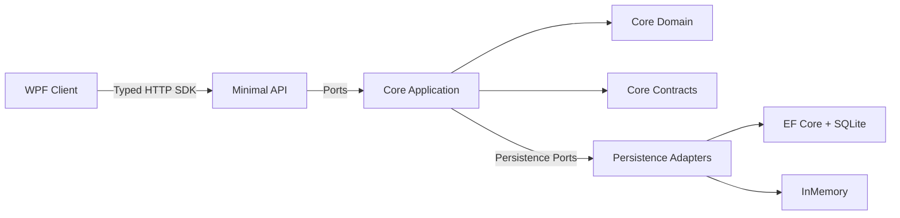
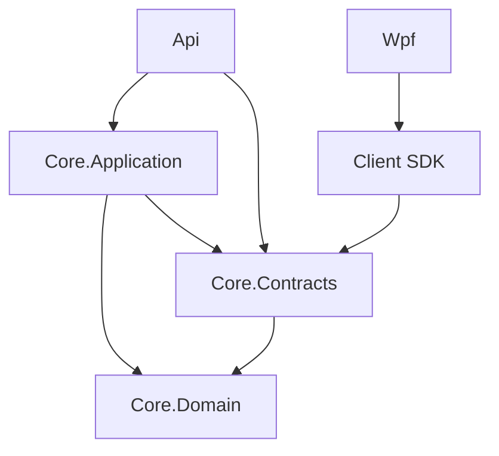
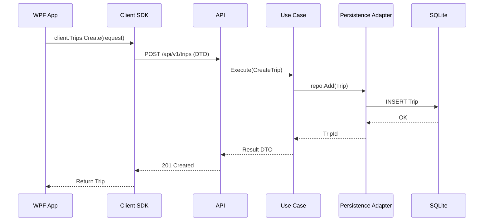
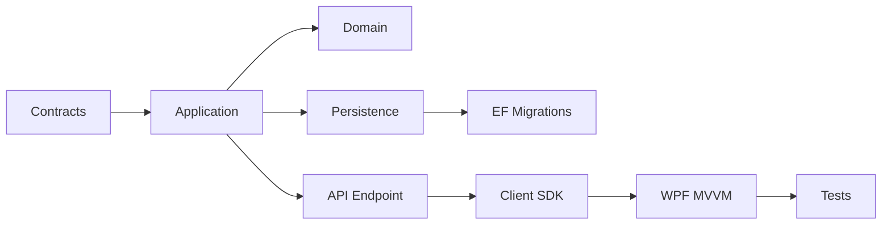
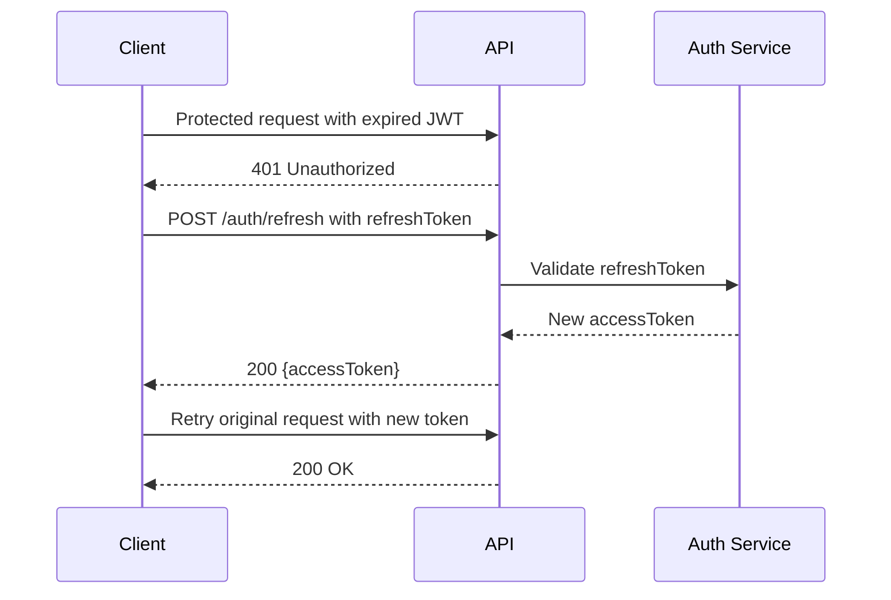

# TripPlanner Developer Guide

Last updated: 2025-09-29 12:21

This guide provides architecture, conventions, and workflows for contributing to TripPlanner. It targets .NET developers building the API, domain, adapters, client SDK, and WPF app.

Table of contents
- Overview and philosophy
- Architecture and solution layout
- Request lifecycle
- Running locally (API, WPF)
- Configuration and secrets
- Database and EF Core migrations
- Testing (unit, integration, smoke)
- Debugging tips
- Adding a new feature end-to-end
- API style and error model
- WPF MVVM patterns
- Coding standards
- Performance and logging
- Release and deployment basics

Overview and philosophy
- Clean architecture: core domain and application are independent of frameworks.
- Ports and adapters: infrastructure swaps (EF vs InMemory) without touching business logic.
- Pragmatic Minimal API and WPF front-end with typed client in between.

Architecture and solution layout
```
src/
  TripPlanner.Core.Domain/           # Entities, value objects, invariants (no external deps)
  TripPlanner.Core.Contracts/        # DTOs, request/response shapes, error model
  TripPlanner.Core.Application/      # Use-cases (interactors) + ports (interfaces)
  TripPlanner.Adapters.Persistence.InMemory/
  TripPlanner.Adapters.Persistence.Ef/
  TripPlanner.Api/                   # Minimal API endpoints, auth, DI, Swagger
  TripPlanner.Client/                # Typed HTTP client (used by WPF)
  TripPlanner.Wpf/                   # WPF (net9.0-windows), MVVM
```

Mermaid: High-level architecture


Mermaid: Source module dependencies (acyclic)


Request lifecycle


Running locally
- Build: dotnet build
- API: dotnet run --project src\TripPlanner.Api
- WPF: dotnet run --project src\TripPlanner.Wpf
- All tests: dotnet test

Configuration and secrets
- API appsettings in src\TripPlanner.Api. Override with env vars, e.g. ConnectionStrings__Default.
- JWT dev keys are for local use only. Replace for real deployments.

Client SDK configuration
- The WPF and other .NET frontends use TripPlanner.Client.
- Configure API base address via TripPlanner.Client.Configuration.TripPlannerClientOptions.BaseAddress (e.g., http://localhost:5162).
- Prefer injecting a single HttpClient instance configured with authentication handlers.

Database and EF Core migrations
- EF adapter: src\TripPlanner.Adapters.Persistence.Ef
- Default connection: Data Source=tripplanner.db (SQLite)
- Commands (install dotnet-ef first):
  dotnet tool install --global dotnet-ef
  dotnet ef migrations add <Name> -p src/TripPlanner.Adapters.Persistence.Ef -s src/TripPlanner.Api
  dotnet ef database update -p src/TripPlanner.Adapters.Persistence.Ef -s src/TripPlanner.Api
- In tests, prefer InMemory adapter to keep tests fast and deterministic.

Testing
- Unit tests: tests\TripPlanner.Tests.Domain
- Integration tests: tests\TripPlanner.Tests.Integration
- Run all: dotnet test
- Smoke script: pwsh tools/smoke-api.ps1

Debugging tips
- Enable detailed logs in Development via appsettings.Development.json.
- For 401 issues, inspect Authorization headers and token expiry.
- For WPF, use Snoop or built-in Live Visual Tree to diagnose bindings.

Adding a new feature end-to-end
1) Contracts
- Define request/response DTOs in Core.Contracts.

2) Application
- Add use-case (service/interactor) in Core.Application; depend on ports.
- Extend ports if new persistence is needed.

3) Domain
- Add/adjust entities and validation rules.

4) Persistence
- Implement repository methods in EF adapter and InMemory adapter.
- Add migration if EF schema changes.

5) API
- Add Minimal API endpoint in src\TripPlanner.Api\Endpoints.
- Map request DTO to use-case; map result to HTTP response.

6) Client SDK
- Add typed method to TripPlanner.Client; keep signatures aligned with Contracts.

7) WPF
- Update ViewModels and Views (XAML). Follow MVVM; no network calls in code-behind.

8) Tests
- Add unit tests for domain and application, and integration tests for API endpoint.

Mermaid: Developer workflow


API style and error model
- Minimal API with conventional routes under /api/v1.
- Return ProblemDetails-compatible errors where possible; include error codes from Core.Contracts.
- Prefer 201 for create, 200 for read/update, 204 for delete, 400/404/409 as appropriate.

Backend: Destinations endpoints (accurate)
- POST /api/v1/trips/{tripId}/destinations/{destinationId}/votes → 204. Current user casts their own vote. 401 if not authenticated; 404 if not a participant or destination not in trip.
- DELETE /api/v1/trips/{tripId}/destinations/{destinationId}/votes → 204. Current user removes their own vote. 401/404 similarly.
- POST /api/v1/trips/{tripId}/destinations/{destinationId}/votes/proxy { participantId } → 204. Proxy voting allowed only for placeholder participants (Participant.UserId == null). 400 if not placeholder or invalid ID; 404 if trip/destination not found. Idempotent.
- DELETE /api/v1/trips/{tripId}/destinations/{destinationId}/votes/proxy { participantId } → 204. Removes a proxy vote; same constraints as above.
- GET /api/v1/trips/{tripId}/destinations → 200 [DestinationProposalDto]. Includes Title, Description, ImageUrls, Votes.
- GET /api/v1/trips/{tripId}/destinations/{destinationId}/votes → 200 [participantId]. Returns participant IDs who voted for that destination.

Validation rules (examples)
- ProposeDestinationRequest: Title required, max 256 chars; ImageUrls not null; each ImageUrl non-empty, absolute URL, max 2048 chars (see ProposeDestinationRequestValidator).

Notes
- Vote addition/removal is idempotent in endpoints; duplicates are ignored safely.
- 404 is used to avoid leaking membership when the caller is not a participant in the trip.

WPF MVVM patterns
- ViewModels expose ICommands and observable properties; Views bind via XAML.
- Use converters (e.g., ImageConverters.cs) for UI-specific transformations.
- Keep networking in services injected into ViewModels; avoid static state.
[Screenshot placeholder: MVVM data binding in DestinationsTab] (./images/placeholder-mvvm-destinations.png)

Frontend specifics (Destinations)
- View: src\\TripPlanner.Wpf\\Views\\DestinationsTab.xaml. Uses a WrapPanel within a ScrollViewer to show cards.
- ViewModel: DestinationsViewModel exposes:
  - Properties: TripId, VoterOptions (ObservableCollection<VoterOption>), SelectedVoter, Items (ObservableCollection<DestinationCard>), MyParticipantId.
  - Commands: ToggleVoteCommand(DestinationCard), AddNewCommand(), EditCommand(DestinationCard?).
  - LoadAsync(tripId) calls RefreshVotersAsync and RefreshDestinationsAsync.
  - RecomputeSelectedFlags() updates per-card IsSelectedVoterVoted based on SelectedVoter.
- Card model: DestinationCard has Name, Description, VoteCount, VoterParticipantIds, IsMostVoted, IsSelectedVoterVoted, ImageUrl, and a special IsAddNew flag for the trailing ＋ card.
- Converters and triggers:
  - StringToImageSourceConverter turns ImageUrl into ImageSource.
  - BooleanToVisibilityConverter and style triggers set highlight (IsMostVoted) and green border (IsSelectedVoterVoted).
- Proxy voting logic: If SelectedVoter.ParticipantId is null → self vote via VoteDestinationAsync/UnvoteDestinationAsync; otherwise proxy via ProxyVoteDestinationAsync/ProxyUnvoteDestinationAsync for placeholders only.
- After each action, RefreshDestinationsAsync reloads list and recomputes highlights; an Add… pseudo-card is appended via DestinationCard.CreateAddCard().

Coding standards
- C# 13, nullable enabled; favor immutability for domain types.
- Use records for DTOs; domain entities may be classes with invariants.
- Follow single responsibility; keep methods small and named after intent.
- Use guard clauses and expressive domain methods.

Performance and logging
- Use async APIs end-to-end.
- Avoid chatty DB calls; prefer batching where reasonable.
- Log at Information by default; Debug/Trace locally when needed.

Release and deployment basics
- Containerization via docker-compose.yml available for API.
- For production, configure strong JWT keys and persistent storage volume.

Appendix: Useful paths
- Endpoints: src\TripPlanner.Api\Endpoints
- WPF Views: src\TripPlanner.Wpf\Views
- WPF ViewModels: src\TripPlanner.Wpf\ViewModels
- Converters: src\TripPlanner.Wpf\Converters
- Client SDK interfaces: src\TripPlanner.Client\Abstractions

Additional diagrams

Mermaid: Auth flow (token refresh)


Placeholders for screenshots
- [Screenshot placeholder: Swagger UI overview] (./images/placeholder-swagger.png)
- [Screenshot placeholder: EF migration output] (./images/placeholder-ef-migration.png)
- [Screenshot placeholder: WPF binding diagnostics] (./images/placeholder-wpf-binding.png)
