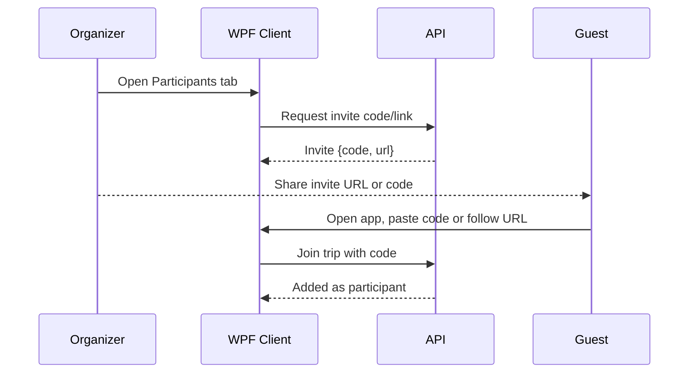
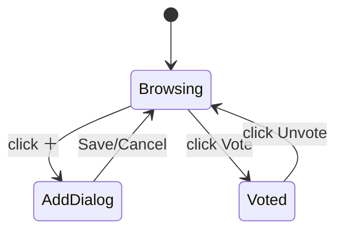
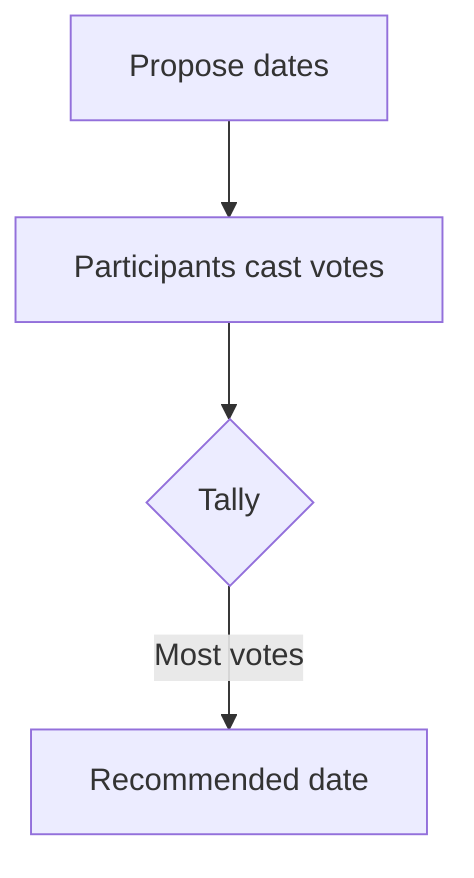

# TripPlanner User Guide

Last updated: 2025-09-29 14:48

This guide helps you install, run, and use TripPlanner to plan trips collaboratively: propose destinations and dates, vote, manage gear, invite participants, and build an itinerary.

Table of contents
- What is TripPlanner?
- Quick start
- Running the app
- Creating and managing a trip
- Inviting participants
- Proposing destinations and voting
- Proposing dates and voting
- Managing gear
- Building your itinerary
- Tips and best practices
- Troubleshooting
- FAQ

What is TripPlanner?
TripPlanner is a desktop-first application with a WPF client and a Minimal API backend. It enables small groups to propose and vote on trip options and organize logistics. You can run everything locally for study or demos.

Quick start
1) Install requirements
- .NET 9 SDK
- Windows 10/11 for WPF client
- Optional: Docker Desktop for API container

2) Start the API
- In a terminal (PowerShell):
  dotnet run --project src\TripPlanner.Api
- Take note of the printed URL (e.g., http://localhost:5162). Swagger is available at /swagger.

3) Start the WPF app
- In another terminal:
  dotnet run --project src\TripPlanner.Wpf
- The WPF app will connect to the API at localhost by default.

Running the app
- Login/Registration
  The first time, register a new account in the WPF app or via Swagger. Your session is stored securely and you can refresh tokens as needed.
  [Screenshot placeholder: Login screen] (./images/placeholder-login.png)

- Home and Navigation
  The main window organizes features into tabs: Dates, Destinations, Gear, Participants.
  [Screenshot placeholder: Main window with tabs] (./images/placeholder-main-tabs.png)

Creating and managing a trip
- Create a new trip with a name and optional description. Trips have statuses (e.g., Active, Finished).
- As an organizer you can change status or archive a trip once finished.
[Screenshot placeholder: Create trip form] (./images/placeholder-create-trip.png)

Inviting participants
- Generate an invite code from the Participants tab.
- Share the code via chat/email. Participants can join by pasting the code.
[Screenshot placeholder: Invite participants dialog] (./images/placeholder-invite.png)

Mermaid: Invite flow (user perspective)

Proposing destinations and voting
- Go to the Destinations tab.
- Click ＋ to propose a destination: name, optional description, image URL.
- Everyone can vote; you can toggle your vote (Vote/Unvote).
- The most voted card is highlighted; your vote is shown with a green border.
[Screenshot placeholder: Destinations tab with cards] (./images/placeholder-destinations.png)
[Screenshot placeholder: Propose destination dialog] (./images/placeholder-destination-dialog.png)

Mermaid: Destinations UI states

Frontend specifics (Destinations)
- Vote as selector: At the top of the Destinations tab, "Vote as" lets you choose yourself or a placeholder participant. Choosing a placeholder enables proxy voting on their behalf.
- Who can be proxied: Only placeholder participants (people not yet registered) can be voted for by others. Real users must vote themselves.
- Visual cues: The destination with the highest vote count is highlighted; if the selected voter has voted for a card, that card shows a green border and the button changes to Unvote.
- Add and Edit: Use the ＋ button to open the dialog. You can set Title (required), Description (optional), and an Image URL. The first image is shown on the card.
- Image URL format: URLs must be absolute (e.g., http://localhost:5162/uploads/rome.jpg). Relative paths are rejected by validation.
- Refresh behavior: After voting or editing, the list reloads so tallies and highlights update.
- Offline: The app requires an active API connection. If offline, actions will fail until reconnected.

API connection note
- The WPF app talks to the API over HTTP. The base address is configurable by the host application via TripPlanner.Client.Configuration.TripPlannerClientOptions.BaseAddress. By default in local runs it points to http://localhost:5162.
- In the WPF app, this can also be provided via appsettings at src/TripPlanner.Wpf/appsettings.json under TripPlanner:BaseAddress.
- Your refresh token is stored securely per Windows user at %LOCALAPPDATA%\TripperApp\tokens.dat. Use the in-app sign-out (if available) or delete this file to force sign-out on next launch.

Proposing dates and voting
- Open the Dates tab.
- Edit the trip date interval, this causes the calendar to zoom in on those dates
- Click to vote on the individual dates, as yourself or as a proxy
- Each date will display the number of votes and it will become greener to higher to participants percentage has voted on this 
- Add one or more term options for the group to consider.
- Vote for your preferred dates; tally updates in real time.
[Screenshot placeholder: Dates tab] (./images/placeholder-dates.png)

Mermaid: Date vote aggregation

Managing gear
- In the Gear tab, propose items in groups and set their goal coumt
- Track who brings what to avoid duplicates.
[Screenshot placeholder: Gear tab] (./images/placeholder-gear.png)

Tips and best practices
- Use clear names and descriptions for destinations and gear.
- Encourage participants to vote early to converge on options.
- Keep images light-weight; the API serves static uploads under /uploads.

Troubleshooting
- I don’t see images in the WPF app
  Ensure the API is running and serving static files; verify the Image URL is reachable (e.g., http://localhost:5162/uploads/myimg.jpg).
- I receive 401/403 errors
  Login again to refresh tokens. Ensure the Authorization header is sent by the client.
- SQLite database is locked
  Stop the API before deleting the database file.

FAQ
- Do I need Docker?
  No. You can run the API and WPF directly with the .NET SDK. Docker is optional.
- Can multiple trips be managed?
  Yes, you can create multiple trips and switch between them.
- Can I export my plan?
  Not yet, but you can retrieve trip data via the API.
